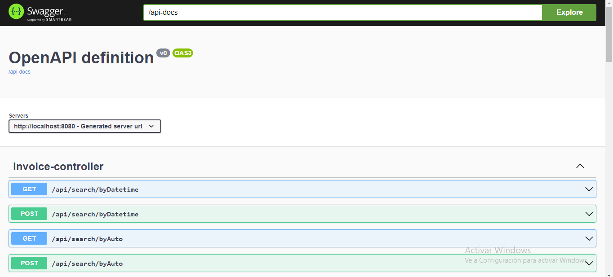

# Viasoft Backend 

Esta API se desarrolla utilizando SpringBoot+JPA+Mysql e incorpora Swagger

## Sobre la API

+ se agregan los modelos en el directorio /models
+ se configuran los respositorios en /repos 
+ se añaden los servicios en /services
+ se añade un controlador en /controller
+ la base de datos se genera automaticamente en caso de no existir
+ se crean las tablas invoice e invoice_history a partir de los propios modelos de datos
+ se crea ademas una tabla denominada states, la cual se genera a partir del fichero /resource/schema.sql
+ se insertan los registros iniciales a la tabla states desde el fichero /resources/data.sql

## Instalación 

1. Instalar y configurar JAVA JDK 14 [Java JDK Download Page](https://www.oracle.com/java/technologies/javase/jdk14-archive-downloads.html).
2. Instalar y configurar MAVEN [Maven Download Page](https://maven.apache.org/download.cgi).
3. Abrir la carpeta del proyecto en tu editor preferido
4. Modificar el fichero /resources/application.properties 
    (actualice las siguientes lineas)
    - spring.datasource.url
    - spring.datasource.username
    - spring.datasource.password
5. Ejecutar el proyecto (debe estar ejecutandose MySQL)
6. Navigate to [localhost:8080/api](http://localhost:8080/api)

